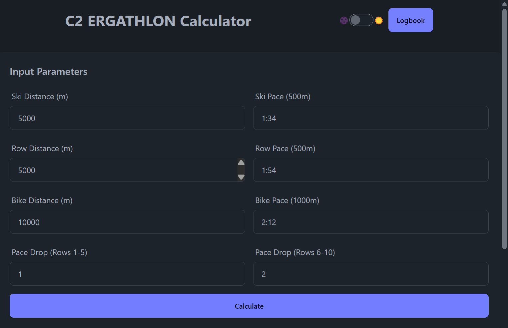
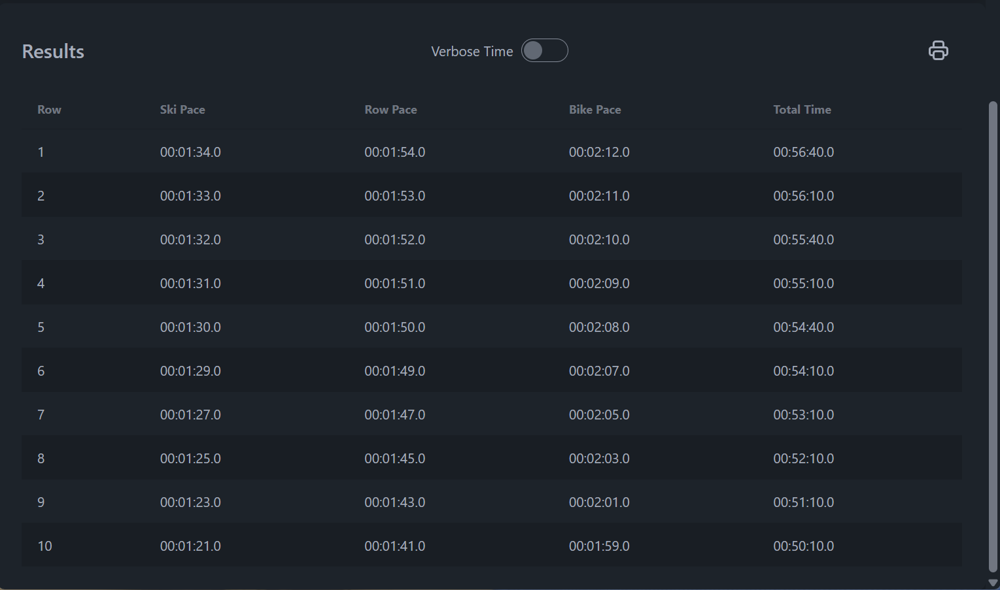
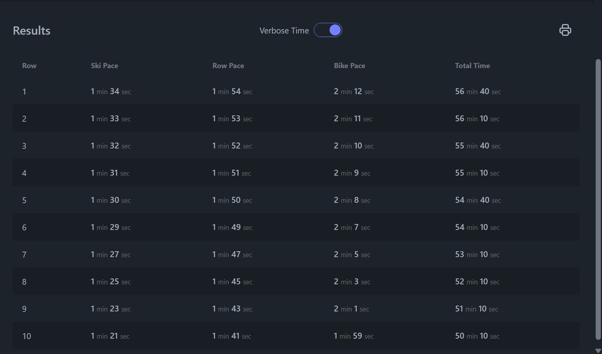
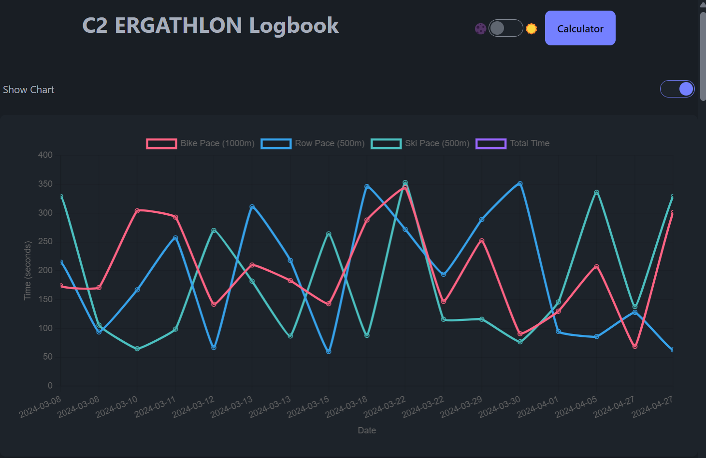
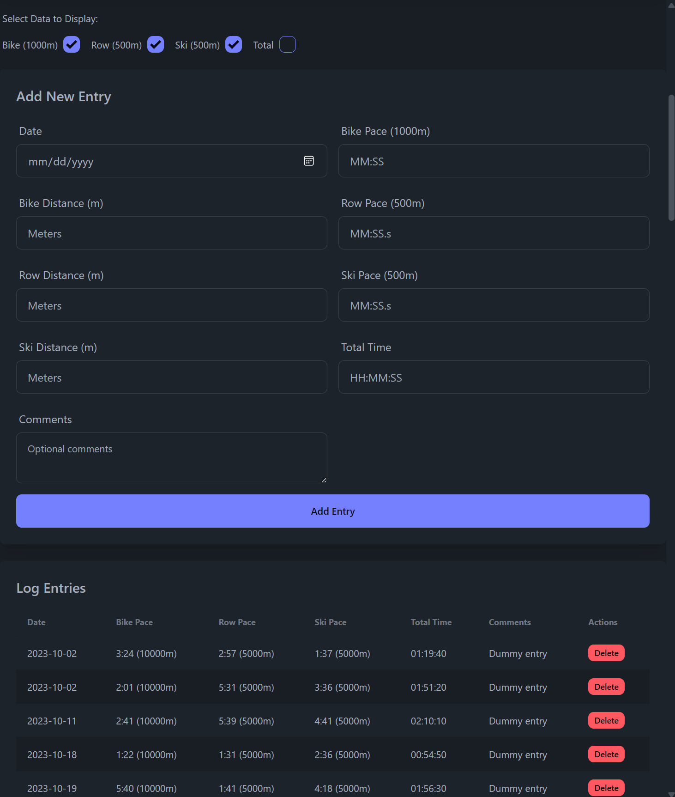

 ## Overview
 The **C2 ERGATHLON** application is a standalone desktop app designed to assist users in calculating and tracking their performance in the C2 ERGATHLON event. The application comprises two main components:
 1. **Quick Glance Page**: Calculates and displays a table showing the total time for the C2 ERGATHLON based on user input parameters.
 2. **Logging Page**: Allows users to log their times for various sessions, view progress over time, and visualize data through graphs.
 ## Application Components
 ### Quick Glance Page
 - Input parameters for personalized calculations.
 - Dynamic generation of data rows with adjustable paces and times.
 - Download PDF of table
 
  
 ### Logging Page
 - Log entries for times, dates, and runs.
 - Option to add comments or notes.
 - View logged data in a tabular format.
 - Interactive progress graphs displaying performance over time.
 ## Technical Stack
 - **Backend**: Python 3.x with **pywebview** to create a standalone desktop application.
 - **Frontend**: HTML, CSS with **Tailwind CSS** and **DaisyUI**, and JavaScript.
 - **Graphs and Charts**: **Chart.js** for data visualization.
 - **Database**: **SQLite** for data storage.
 - **Packaging**: **PyInstaller** to create a standalone executable.
 #### Calculations
 - **Time Calculation**:
 $$\text{Time} = \left( \frac{\text{Distance}}{500} \right) \times \text{Split Time}$$
 - **Pace Adjustment**:
 $$\text{New Split Time} = \text{Previous Split Time} - \text{Pace Drop}$$
 #### Output Table Columns
 - **SQLite Database**:
 - Stored in `data/database.db`.
 - Uses `sqlite3` module or an ORM like SQLAlchemy for interactions.
 - **HTML & CSS**:
 - Structured using semantic HTML5.
 - Styled with **Tailwind CSS** compiled into `tailwind.css`.
 - **DaisyUI** components used for UI elements.
 - Custom styles in `styles.css`.
 - **JavaScript**:
 - **calculations.js**: Contains all calculation logic:
 - Time conversions.
 - Pace adjustments.
 - Total time calculations.
 - Dynamic table generation.
 - **main.js**: Handles general frontend logic and interaction with the backend via pywebview's API.
 Addittional or future requirments as well. 
 Leave some space for Images, probably just 2 as of now for each page.

#### _Assistant_

 Here's a README for GitHub based on the provided information and code:
 
 # C2 ERGATHLON
 
 ## Overview
 
 The **C2 ERGATHLON** application is a standalone desktop app designed to assist users in calculating and tracking their performance in the C2 ERGATHLON event. The application comprises two main components:
 
 1. **Quick Glance Page**: Calculates and displays a table showing the total time for the C2 ERGATHLON based on user input parameters.
 2. **Logging Page**: Allows users to log their times for various sessions, view progress over time, and visualize data through graphs.
 
 ## Application Components
 
 ### Quick Glance Page
 
 - Input parameters for personalized calculations.
 - Dynamic generation of data rows with adjustable paces and times.
 - Download PDF of table.
 
 

 

 
 
 ### Logging Page
 
 - Log entries for times, dates, and runs.
 - Option to add comments or notes.
 - View logged data in a tabular format.
 - Interactive progress graphs displaying performance over time.
 
 

 
 
 ## Technical Stack
 
 - **Backend**: Python 3.x with **pywebview** to create a standalone desktop application.
 - **Frontend**: HTML, CSS with **Tailwind CSS** and **DaisyUI**, and JavaScript.
 - **Graphs and Charts**: **Chart.js** for data visualization.
 - **Database**: **SQLite** for data storage.
 - **Packaging**: **PyInstaller** to create a standalone executable.
 
 ## Calculations
 
 - **Time Calculation**:
   ```
   Time = (Distance / 500) × Split Time
   ```
 - **Pace Adjustment**:
   ```
   New Split Time = Previous Split Time - Pace Drop
   ```
 
 ## Implementation Details
 
 ### Backend
 
 - **Python**: The main application logic is implemented in `main.py`, which uses pywebview to create the desktop application interface.
 - **SQLite Database**:
   - Stored in `data/ergathlon.db`.
   - Database operations are handled in `backend/database.py`.
 
 ### Frontend
 
 - **HTML & CSS**:
   - Structured using semantic HTML5 in `frontend/index.html` and `frontend/logging.html`.
   - Styled with **Tailwind CSS** and **DaisyUI**.
   - Custom styles in `frontend/css/input.css`.
 
 - **JavaScript**:
   - `frontend/js/calculations.js`: Contains all calculation logic.
   - `frontend/js/main.js`: Handles general frontend logic for the Quick Glance page.
   - `frontend/js/logging.js`: Manages the Logging page functionality.
 
 ## Setup and Installation
 
 1. Clone the repository:
    ```
    git clone https://github.com/yourusername/C2_ERGATHLON.git
    ```
 
 2. Install Python dependencies:
    ```
    pip install -r requirements.txt
    ```
 
 3. Install Node.js dependencies:
    ```
    npm install
    ```
 
 4. Run the application:
    ```
    python main.py
    ```
 
 ## Building the Executable
 
 To create a standalone executable, use PyInstaller:
 
 ```
 pyinstaller C2_ERGATHLON.spec
 ```
 
 ## Future Enhancements
 
 - Integration with Concept2 logbook API for automatic data import.
 - Additional data analysis features and performance metrics.
 - Multi-user support with cloud synchronization.
 
 ## Contributing
 
 Contributions to the C2 ERGATHLON project are welcome. Please feel free to submit pull requests or open issues for bugs and feature requests.